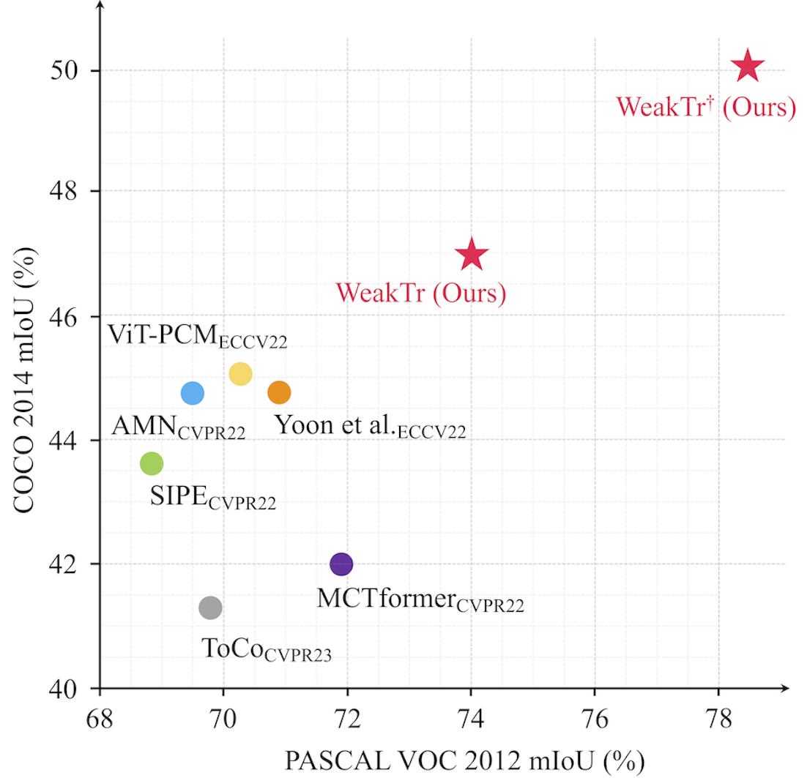
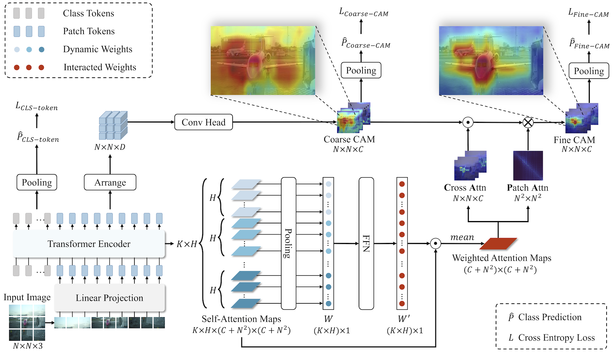
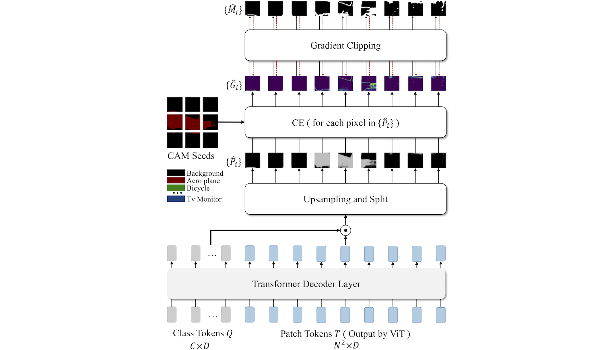

<div align="center">
<h1>WeakTr </h1>
<h3>Exploring Plain Vision Transformer for Weakly-supervised Semantic Segmentation</h3>

[Lianghui Zhu](https://github.com/Unrealluver)<sup>1</sup> \*, [Yingyue Li](https://github.com/Yingyue-L)<sup>1</sup> \*, [Jiemin Fang](https://jaminfong.cn)<sup>1</sup>, Yan Liu<sup>2</sup>, Hao Xin<sup>2</sup>, [Wenyu Liu](http://eic.hust.edu.cn/professor/liuwenyu/)<sup>1</sup>, [Xinggang Wang](https://scholar.google.com/citations?user=qNCTLV0AAAAJ&hl=zh-CN)<sup>1 :email:</sup>
 
<sup>1</sup> School of EIC, Huazhong University of Science & Technology, <sup>2</sup> Ant Group 

(\*) equal contribution, (<sup>:email:</sup>) corresponding author.

ArXiv Preprint ([arXiv 2304.01184](https://arxiv.org/abs/2304.01184))


</div>


## Highlight

<div align="center">

[](https://paperswithcode.com/sota/weakly-supervised-semantic-segmentation-on?p=weaktr-exploring-plain-vision-transformer-for)
[](https://paperswithcode.com/sota/weakly-supervised-semantic-segmentation-on-1?p=weaktr-exploring-plain-vision-transformer-for)
[](https://paperswithcode.com/sota/weakly-supervised-semantic-segmentation-on-14?p=weaktr-exploring-plain-vision-transformer-for)
[](https://paperswithcode.com/sota/weakly-supervised-semantic-segmentation-on-4?p=weaktr-exploring-plain-vision-transformer-for)

</div>


<div align=center></div>

- The proposed WeakTr fully explores the potential of plain ViT in the WSSS domain. State-of-the-art results are achieved on both challenging WSSS benchmarks, with **74.0%** mIoU on VOC12 and **46.9%** on COCO14 validation sets respectively, significantly surpassing previous methods.
- The proposed WeakTr based on the DINOv2 which is pretrained on ImageNet-1k and the extra LVD-142M dataset performs better with **75.8%** mIoU on VOC12 and **48.9%** on COCO14 validation sets respectively.
- The proposed WeakTr based on the improved ViT which is pretrained on ImageNet-21k and fine-tuned on ImageNet-1k performs better with **78.4%** mIoU on VOC12 and **50.3%** on COCO14 validation sets respectively.
- The proposed WeakTr based on the EVA-02 which uses EVA-CLIP as the masked image modeling(MIM) teacher and is pretrained on ImageNet-1k performs better with **78.5%** mIoU on VOC12 and **51.1%** on COCO14 validation sets respectively.

## Introduction 

This paper explores the properties of the plain Vision Transformer (ViT) for Weakly-supervised Semantic Segmentation (WSSS). The class activation map (CAM) is of critical importance for understanding a classification network and launching WSSS. We observe that different attention heads of ViT focus on different image areas. Thus a novel weight-based method is proposed to end-to-end estimate the importance of attention heads, while the self-attention maps are adaptively fused for high-quality CAM results that tend to have more complete objects. 

**Step1: End-to-End CAM Generation**

<div align=center></div>


Besides, we propose a ViT-based gradient clipping decoder for online retraining with the CAM results to complete the WSSS task. We name this plain **Tr**ansformer-based **Weak**ly-supervised learning framework WeakTr. It achieves the state-of-the-art WSSS performance on standard benchmarks, i.e., 78.5% mIoU on the val set of VOC12 and 51.1% mIoU on the val set of COCO14.

**Step2: Online Retraining with Gradient Clipping Decoder**

<div align=center></div> 


## News
- **`2023/08/31`**: 🔥 We update the experiments based on the EVA-02 and DINOv2 pretrain weight which need to [update the environment](docs/Install.md#environment-update).

## Getting Started
- [Installation](docs/Install.md)
- [Prepare Dataset](docs/prepare_dataset.md)
- [Training](docs/Training.md)
- [Evaluate](docs/Evaluate.md)


## Main results

### Step1: End-to-End CAM Generation

|     Dataset     |     Method     | Backbone |                        Checkpoint                          |                          CAM_Label                           | Train mIoU |
| :-------------: | :-------------: |  :-------------: |:----------------------------------------------------------: | :----------------------------------------------------------: | :--------: |
| VOC12 | WeakTr | `DeiT-S` | [Google Drive](https://drive.google.com/file/d/1uUHGLIDFm49Gh41Ddc8_T93-bRWnJzeF/view?usp=share_link) | [Google Drive](https://drive.google.com/file/d/1zv3Wq056aHdUaaKEuychGnedXqkMLr5y/view?usp=share_link) |   **69.4%**    |
| COCO14 |    WeakTr    | `DeiT-S` | [Google Drive](https://drive.google.com/file/d/1Q5UdcGCHFitSJXljZmTA4USKPpyZIVDw/view?usp=drive_link) | [Google Drive](https://drive.google.com/file/d/1ifhVOZX4P9Ku7g66SWNXYyZgCIShQ42P/view?usp=drive_link) |   **42.6%**    |

### Step2: Online Retraining with Gradient Clipping Decoder

|                        Dataset                        |                        Method                           |  Backbone |                                             Checkpoint                                             | Val mIoU | Pseudo-mask | Train mIoU |
|:----------------------------------------------------------:|:-----------------------------------------------------:| :--------------------: | :---------: | :--------: | :--------: | :--------: |
|                           VOC12                           |                           WeakTr                          | `DeiT-S` | [Google Drive](https://drive.google.com/file/d/1ONY86MyHSjjoKGdPI_0wmxQ_Go-39W2C/view?usp=share_link) | 74.0% | [Google Drive](https://drive.google.com/file/d/1Z6ioXhy6L4_2XMrj2dk7QiYPzZnWdbt-/view?usp=share_link) | 76.5%      |
| VOC12 | WeakTr | `DINOv2-S` | [Google Drive](https://drive.google.com/file/d/1rHu7cSeqc-fLu-_J72UciyL44S7fjCh4/view?usp=drive_link) | 75.8% | [Google Drive](https://drive.google.com/file/d/1f6FeoUt0uf1tmJc9hTDuORAAmOzeTlfD/view?usp=drive_link) | 78.1% |
| VOC12 | WeakTr | `ViT-S` | [Google Drive](https://drive.google.com/file/d/1lLY4iNplYTDTTOtnE10OzdjtMDZZfJX0/view?usp=sharing) | 78.4% | [Google Drive](https://drive.google.com/file/d/1kEhlTVZvIqMGD5ck8UDTxWxXD7UMf3VZ/view?usp=share_link) | **80.3%**  |
| VOC12 | WeakTr | `EVA-02-S` | [Google Drive](https://drive.google.com/file/d/1Vf0oNC8P_4E9HN-vQfxMRU1sl4KuRdf1/view?usp=sharing) | **78.5%** | [Google Drive](https://drive.google.com/file/d/1uydc2YHBeiYCIjfABlPz3O2e04knCRzT/view?usp=drive_link) | 80.0%  |
| COCO14 | WeakTr | `DeiT-S` | [Google Drive](https://drive.google.com/file/d/1iZN0Gcg_uVRUgxlmQs7suAGjv6bsj4EX/view?usp=share_link) | 46.9% | [Google Drive](https://drive.google.com/file/d/1qZaiKqqAWFfY_-yxqcv8T29o8z9KytbJ/view?usp=share_link) | 48.9%      |
| COCO14 | WeakTr | `DINOv2-S` | [Google Drive](https://drive.google.com/file/d/1U8fA5lSVsrYN5CajqtyUew2NH0dfBZIn/view?usp=drive_link) | 48.9% | [Google Drive](https://drive.google.com/file/d/160DSl-2-Y1UKD7s131cKjqriYBm8vbO1/view?usp=drive_link)| 50.7%  |
| COCO14 | WeakTr | `ViT-S` | [Google Drive](https://drive.google.com/file/d/13Gr_S8pG42IWDwcvvLcPmSfCW_MSa8fL/view?usp=share_link) | 50.3% | [Google Drive](https://drive.google.com/file/d/1p-t-4pPIpJZDmj-oJ16PKVG3Yu8sNiaF/view?usp=share_link) | 51.3%  |
| COCO14 | WeakTr | `EVA-02-S` | [Google Drive](https://drive.google.com/file/d/1mWLn6idxvjveEHt4sF_uZKJa0a6ftGp4/view?usp=drive_link) | **51.1%** | [Google Drive](https://drive.google.com/file/d/16gN0pnWn-U1HK8bSQiJUM__U3xq6Z6V_/view?usp=drive_link) | **52.2%**  |
## Citation
If you find this repository/work helpful in your research, welcome to cite the paper and give a ⭐. 
```
@article{zhu2023weaktr,
      title={WeakTr: Exploring Plain Vision Transformer for Weakly-supervised Semantic Segmentation}, 
      author={Lianghui Zhu and Yingyue Li and Jiemin Fang and Yan Liu and Hao Xin and Wenyu Liu and Xinggang Wang},
      year={2023},
      journal={arxiv:2304.01184},
}
```

